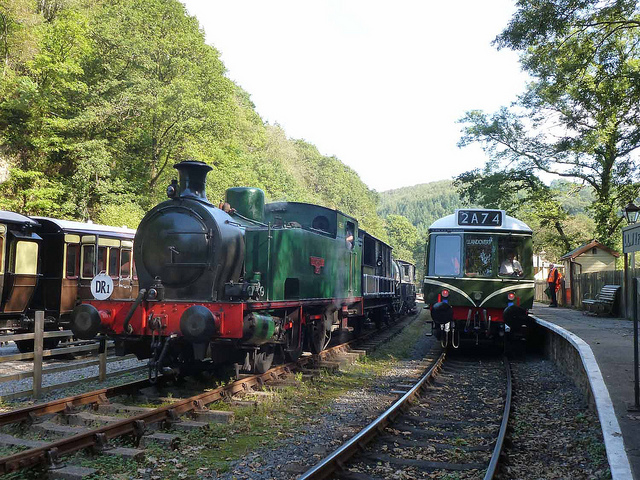
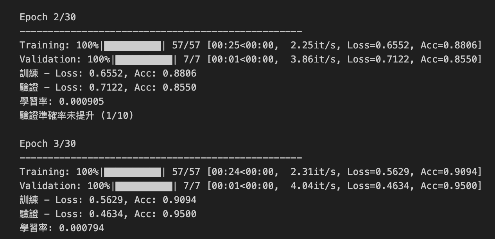

# COCO 四類別圖像分類模型設計

## I. 選定類別

**1. 我們從 MS COCO 資料集中選擇了以下四個類別作為分類目標**

| 內部標籤 ID | 類別名稱 | COCO Category ID |
| :---------: | :------: | :--------------: |
| 0           | bear (熊) | 23               |
| 1           | elephant (大象) | 21               |
| 2           | airplane (飛機) | 5                |
| 3           | train (火車) | 7                |

- 目標類別列表為 `['bear', 'elephant', 'airplane', 'train']` 
- 選擇原因：coco主要是物件偵測資料集，特色是圖像內具有多個物件較貼近真實世界，但多物件出現在一張圖片中不易做物件分類(ground truth定義也不明確)因此選擇了圖片內容相對單一且彼此特徵差異大的類別。

  
  
  
  

## II. 神經網路骨幹 (Backbone NN) 選擇與修改

### 1. 我選擇了 **EfficientNet B3** 作為本次圖像分類任務的骨幹網路

- 選擇理由:在相似精確率的情況下，EfficientNet的模型大小較輕量化，記憶體用量較低，加上以資料集來說，分類任務難度並不大，因此選擇收斂更快、精度更高的EfficientNet B3

### 模型參數量比較

| 模型            | 參數量（約）        | 
|-----------------|--------------------|
| EfficientNet-B3 | ≈ 12.23 百萬 (12.2M) | 
| ResNet-50       | ≈ 25.6 百萬 (25.6M) | 
| ResNet-101      | ≈ 44.5 百萬 (44.5M) | 

### 2. 骨幹網路修改 (Modification)

- 為了適應 4 類別分類任務，我們客製化了 EfficientNet 的分類頭 ：

*   **特徵提取器：** 使用 `timm.create_model` 載入 EfficientNet B3，並設定 `num_classes=0` 和 `global_pool=''`，這將骨幹網路的原始分類頭和全域池化層移除 。
*   **自定義分類頭：** 我們設計了一個包含多層感知機 (MLP) 的分類頭：
    *   **池化層：** 首先使用 **全域平均池化** (`nn.AdaptiveAvgPool2d((1, 1))`) 將骨幹提取的特徵轉換為固定維度，隨後進行展平 (`nn.Flatten()`) 。
    *   **線性/標準化層：** 包含多個線性層 (`nn.Linear`)、ReLU 激活函數，並在線性層之後使用 **批次標準化** (`nn.BatchNorm1d`) 以穩定訓練。
    *   **泛化增強：** 在分類頭中使用了 **Dropout 層** (丟棄率設定為 `0.3` 和 `0.3/2`)，以提高模型泛化能力並防止在較小規模資料集上過擬合。
*   **權重初始化：** 對於分類頭中的線性層，我們使用了 **Xavier Normal 初始化** (`nn.init.xavier_normal_`) 權重，並將偏置初始化為 0。

## III. 資料處理與模型訓練

### 1. 資料集準備
- 下載coco註釋文件，篩選出包含目標 4 類別的圖片，之後分批次下載圖片到本地儲存，確保圖片在訓練前可用

| 類別       | COCO ID | Train | Validation | Test |
|------------|---------|-------|------------|------|
| bear       | 23      | 450   | 50         | 50   |
| elephant   | 21      | 450   | 50         | 50   |
| airplane   | 5       | 450   | 50         | 50   |
| train      | 7       | 450   | 50         | 50   |
| **總計**   | -       | 1800  | 200        | 200  |

### 2. 訓練參數與技巧

* **Loss Function：**  
  使用 **交叉熵損失 (`nn.CrossEntropyLoss`)**，並加入 **標籤平滑 (label_smoothing=0.1)**。  
  - 原因：交叉熵是多類別分類的標準損失函數，能直接衡量模型預測分布與真實標籤的差距。  
  - 標籤平滑可以 **降低模型對單一類別過度自信**，提高泛化能力，尤其在資料集較小或類別不平衡時效果明顯。

* **Optimizer：**  
  採用 **AdamW**，初始學習率為 **0.001**，並加入 **權重衰減 (`weight_decay=0.01`)**。  
  - 原因：AdamW 是 Adam 的改良版，將權重衰減正確應用於參數更新，有助於 **防止過擬合**。  

* **Scheduler：**  
  使用 **餘弦退火重啟 (`CosineAnnealingWarmRestarts`)**，第一次重啟週期 $T_0=10$，每次重啟後週期加倍 $T_\text{mult}=2$。  
  - 原因：餘弦退火能讓學習率從初始值慢慢衰減，避免訓練過程震盪。  
  - Warm restart 可在衰減結束時**重新提升學習率**，幫助模型跳出局部最小值，提升最終準確率。

* **訓練穩定性技巧：**  
  - **混合精度訓練 (`torch.cuda.amp.autocast`)**：加速訓練並降低 GPU 記憶體消耗，特別適合大型骨幹網路。  
  - **梯度裁剪 (`torch.nn.utils.clip_grad_norm_`)**：將梯度最大範數限制為 1.0，以防止梯度爆炸造成訓練不穩定。

* **早停機制：**  
  - 設定耐心值 `patience=10`，若驗證準確率連續 10 輪未提升則停止訓練。  
  - 原因：可避免模型過度訓練，節省計算資源，並降低過擬合風險。

### 3. 訓練結果
- batchsize = 32
- epoch = 13 (達標即停止訓練)

## IV. 評估設計

### 1. 二元化評估機制

標準的多分類任務無法直接提供每個類別的整體準確率
因此，我對每個目標類別（bear, elephant, airplane, train）進行獨立的二元分類評估：

- **標籤轉換：**  
  針對類別 $i$，將真實標籤 (`y_true`) 和預測標籤 (`y_pred`) 轉換為二元形式：
  - 類別 $i$ 被視為 **Positive (1)**  
  - 其他類別被視為 **Negative (0)** [24, 25]  
- 轉換後得到 `y_true_binary` 和 `y_pred_binary`，用於二元分類計算。

---

### 2. 類別混淆矩陣與指標計算

- **繪製混淆矩陣：**  
  在 `plot_confusion_matrices` 函數中，循環繪製四個獨立的二元混淆矩陣，每個矩陣明確展示該類別的：
  - True Positive (TP)  
  - True Negative (TN)  
  - False Positive (FP)  
  - False Negative (FN)

- **準確率計算：**  
  每個類別的二元分類準確率由其二元混淆矩陣元素計算：
  $$
  Accuracy = \frac{TP + TN}{TP + TN + FP + FN}
  $$
  - 計算結果會顯示在每個類別混淆矩陣的子圖標題中

## Test 資料集各類別分類成果分數

| 類別     | Accuracy | Precision | Recall | F1-score |
|-----------|---------|----------|-------|---------|
| bear      | 0.990   | 1.000    | 0.960 | 0.980   |
| elephant  | 0.965   | 0.939    | 0.920 | 0.929   |
| airplane  | 0.960   | 0.889    | 0.960 | 0.923   |
| train     | 0.985   | 0.980    | 0.960 | 0.970   |

---

### 圖像分類評估指標對照表

| 評估指標 | 計算公式 / 基礎元素 | 專注點與定義 | 在專案中的角色與重要性 |
|----------|----------------------|---------------|--------------------------|
| **準確率 (Accuracy)** | $\frac{TP + TN}{TP + TN + FP + FN}$ | 衡量模型在所有樣本中做出正確判斷（包括正確識別和正確拒絕）的整體比例。 | 核心達標指標。程式碼客製化計算每個類別的二元準確率，用於驗證是否達到每個類別高於 95% 的作業要求。 |
| **精確率 (Precision)** | $\frac{TP}{TP + FP}$ | 衡量在所有被模型預測為該類別的樣本中，實際正確的比例。 | 衡量預測結果的可靠性或純度 (避免將不屬於該類別的樣本錯誤識別進來，即避免假正例 FP)。 |
| **召回率 (Recall)** | $\frac{TP}{TP + FN}$ | 衡量在所有實際屬於該類別的樣本中，被模型正確捕捉到的比例。 | 衡量模型捕捉目標類別樣本的完整性 (避免遺漏該類別的樣本，即避免假負例 FN)。 |
| **F1 分數 (F1 Score)** | $2 \times \frac{\text{Precision} \times \text{Recall}}{\text{Precision} + \text{Recall}}$ | 精確率和召回率的調和平均數。 | 提供一個單一指標來綜合評估類別性能，尤其在類別不平衡或需要同時顧及 FP 和 FN 代價時更有參考價值。 |
